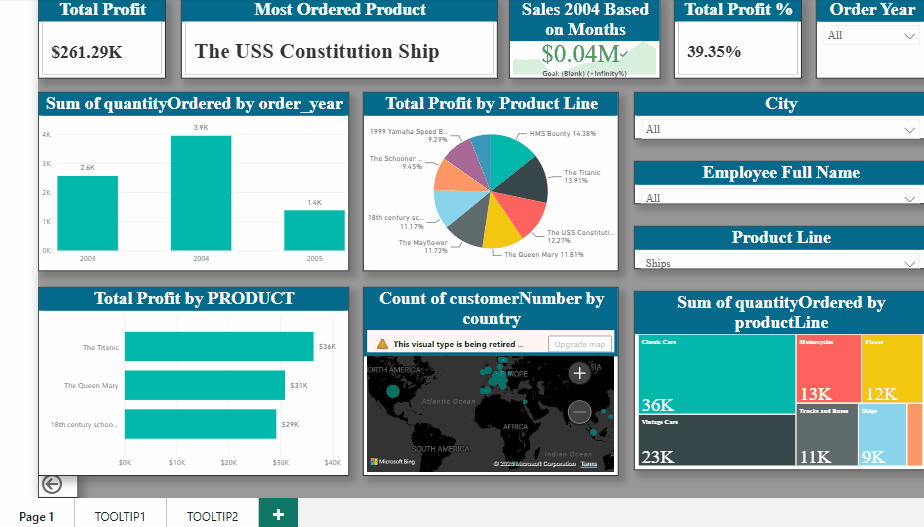

# 📊 Power BI Dashboard – Classic Models Sales Analysis

## Overview
An interactive Power BI dashboard built on the Classic Models relational dataset (8 tables), analyzing business performance across products, customers, employees, and geographies.

## 📊 Dashboard Preview

## 🛠️ Tools & Techniques
- **Power BI Desktop** – Report design & publishing
- **DAX** – Custom measures (Total Profit, Profit %, YoY Sales)
- **Power Query** – Data transformation & table relationships

## 🔍 Key Features
- 📦 Product Line-wise revenue & quantity analysis
- 📅 Year-over-Year sales comparison (2003 vs 2004)
- 💰 KPI Cards: Total Profit, Profit %, Most Ordered Product
- 🗺️ Global customer distribution via Map visual
- 👤 Employee-wise sales performance (Clustered Bar)
- 🎛️ Interactive slicers for dynamic filtering

## 📈 Key Insights
- *(Add 2–3 actual numbers here — e.g. top product line's share of revenue, YoY growth %, top-performing employee's sales figure)*

## 🎨 Visuals Used
Bar Chart · Column Chart · Pie Chart · Treemap · Map · KPI · Card Visuals · Slicers

## 📁 Files
- `ClassicModels_Sales.pbix` — full Power BI report file (open in Power BI Desktop)
- `screenshots/` — dashboard demo GIF/preview

## 📦 Dataset
Classic Models – a sample B2B database of a scale model vehicles retailer with 8 relational tables.

## 👤 Author
**Pratyush Kumar Singh**
[LinkedIn](https://linkedin.com/in/pratyush-singh-ds/) · [GitHub](https://github.com/pratyush460-cell)
